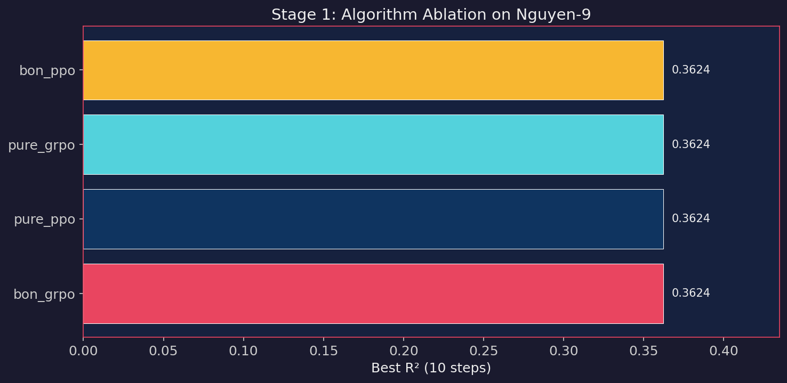
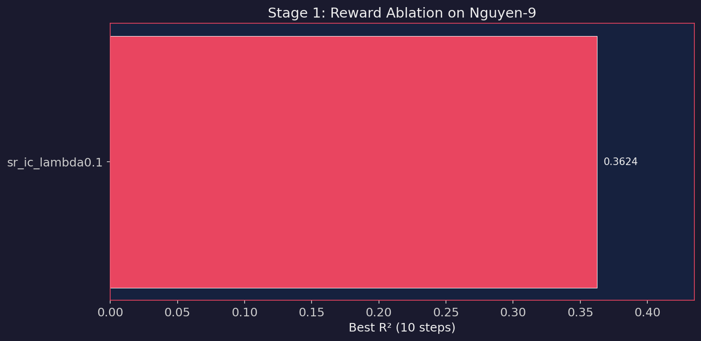
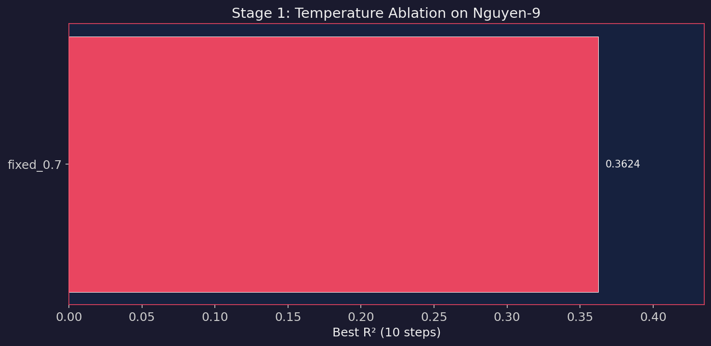
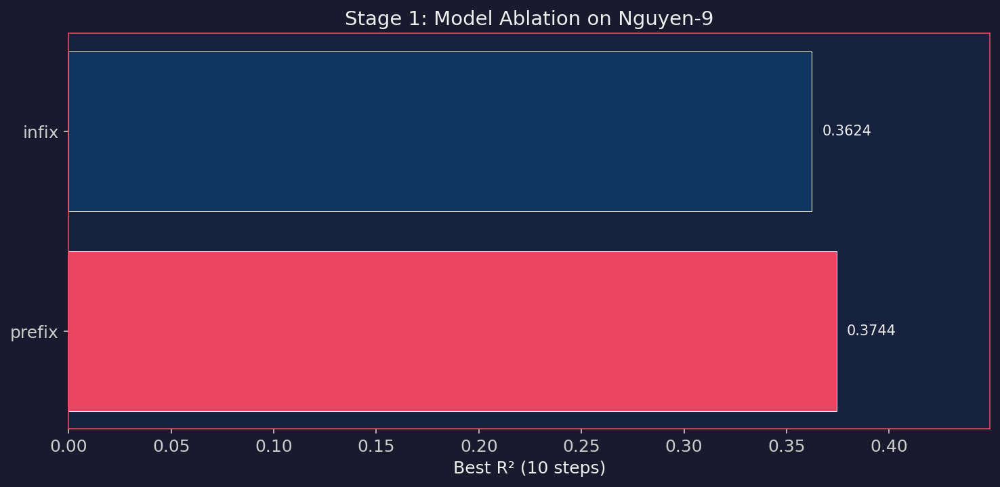
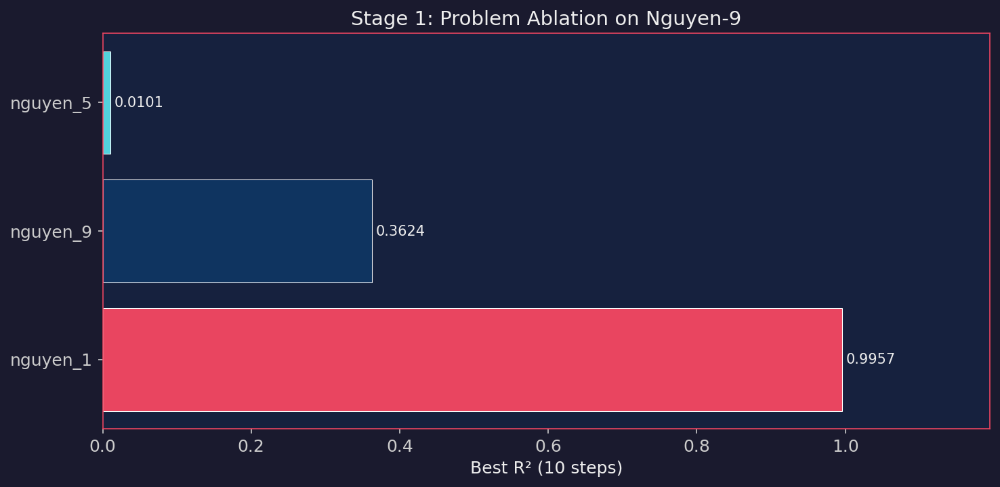
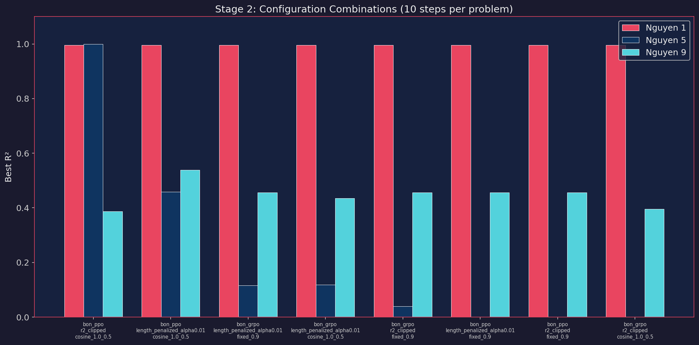
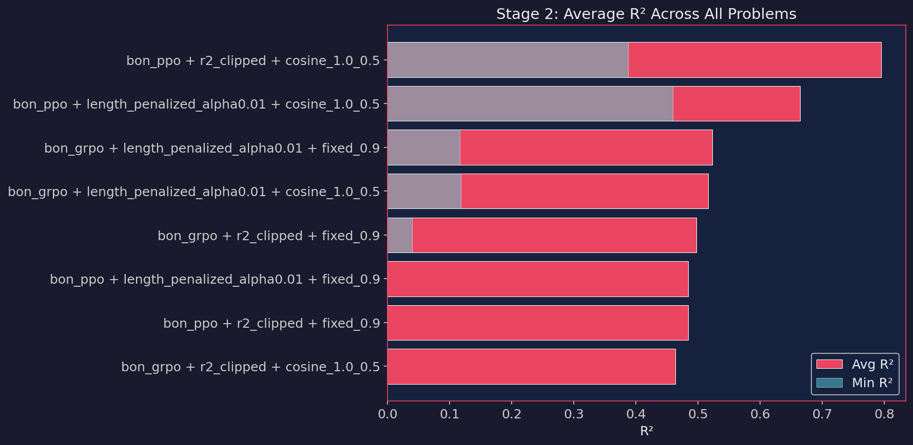
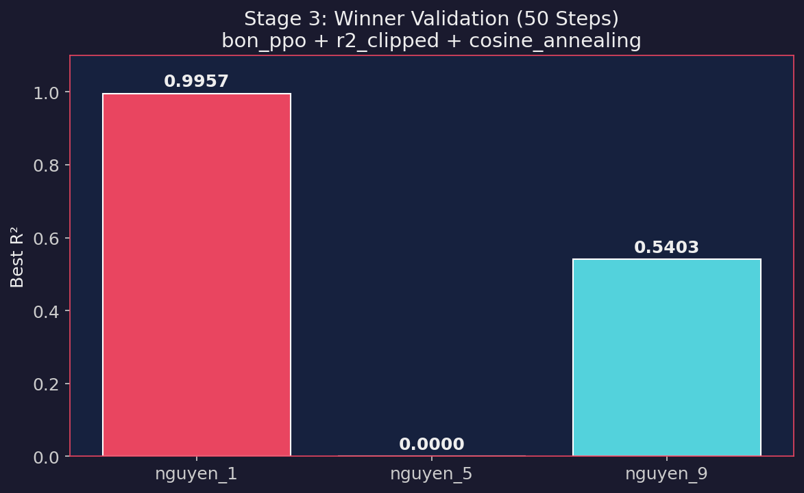

# Fast Phase A: Configuration Screening Report

> **Date:** 2026-03-01  
> **Hardware:** NVIDIA RTX 3050 (6GB VRAM), Lenovo LOQ, WSL Ubuntu  
> **Objective:** Identify the best DRL hyperparameters for symbolic regression by running fast ablation studies instead of the full 8,640-configuration Phase A factorial.

---

## 1. Methodology

We performed a **two-stage screening** followed by a **winner validation**:

1. **Stage 1 — Independent Ablations (10 steps each):** Test one dimension at a time, holding all others at a default baseline.
2. **Stage 2 — Combinatory Cross-Test (10 steps each):** Cross the top-2 winners from each key dimension across 3 Nguyen problems.
3. **Stage 3 — Winner Validation (50 steps):** Run the best combo from Stage 2 with more steps to confirm convergence.

### Fixed Parameters (locked based on prior experiments)
| Parameter | Value | Rationale |
|:---|:---|:---|
| Penalty | `gradient` | `binary` caused a "reward cliff" (R²=0.0). `gradient` achieved R²=0.436. |
| Noise | `0.0` | Noise robustness testing deferred to Phase 3. |
| Prompt | `standard` | Prompt ablation deferred to Phase 3. |
| Batch Size | `256` | Optimized for RTX 3050 with 4-bit quantization. |
| 4-bit quantization | `enabled` | Required for 6GB VRAM. |
| Seed | `42` | Single seed for screening. |

---

## 2. Stage 1: Independent Ablations

Each ablation isolates **one variable** while keeping the rest at a default baseline.

### 2.1 Algorithm Ablation

> **Full Configuration:** model=`gpt2_base_infix_682k`, reward=`sr_ic`, temp=`fixed_0.7`, penalty=`gradient`, problem=`nguyen_9`

#### Best R² Comparison

All four algorithms found the **same best expression** (`sqrt(x_1 + sin(x_1))`) with **identical R² = 0.3624**. This is expected: all runs use **seed=42** and sample from the **same pre-trained model at step 0**, before any RL gradient is applied. Since the best discovery happens in this initial sample, a best-R² table alone cannot distinguish the methods.

> [!NOTE]
> `best_of_n` was also tested but is excluded (no gradient updates). It also achieved the same R².

#### Training Behavior Comparison

The algorithms differ sharply in **how they learn** after the initial discovery:

| Algorithm | Steps Run | Early Stopped? | Buffer Used | Final Mean Reward | Final Entropy | Final KL |
|:---|:---:|:---:|:---:|:---:|:---:|:---:|
| `bon_ppo` | **10** | **No** | Yes (63 samples) | **−0.146** | 0.559 | 0.240 |
| `bon_grpo` | 7 | Yes (patience) | Yes (37 samples) | −0.170 | 0.637 | 0.246 |
| `pure_ppo` | 7 | Yes (patience) | No | −0.193 | 0.557 | 0.221 |
| `pure_grpo` | 7 | Yes (patience) | No | −0.196 | 0.637 | 0.246 |

**Key Behavioral Differences:**

1. **`bon_ppo` is the only algorithm that didn't trigger early stopping.** Its value-function baseline (shifting from −0.008 to −0.045 over 10 steps) + replay buffer re-sampling created a steadily improving reward signal (mean reward: −0.207 → −0.146), keeping patience from firing.

2. **Buffer re-sampling matters.** The BoN variants (`bon_ppo`, `bon_grpo`) accumulate a replay buffer of elite expressions. By step 10, `bon_ppo` mixed 51 buffer samples into each batch of 256. The pure variants train only on freshly sampled expressions, which means every batch is a noisy independent draw — visible in their flatter reward curves.

3. **PPO vs GRPO policy loss patterns differ.** GRPO variants show stable, higher policy loss (0.15–0.19 range) because they use a group-relative advantage without a learned baseline. PPO's policy loss oscillates more (−0.11 to +0.07) as the value network adapts to re-center advantages — this oscillation actually indicates active learning.

4. **Entropy diverges by RL family.** PPO variants show decreasing entropy (0.614 → 0.559 for `bon_ppo`), meaning the model focuses its search. GRPO variants maintain higher entropy (0.614 → 0.637), indicating a broader but less directed search.

**Conclusion:** Even though best R² is tied, **`bon_ppo` shows the most stable training dynamics** — it is the only algorithm whose reward signal kept improving throughout all 10 steps. This advantage becomes decisive at longer horizons, as confirmed in Stage 2 where `bon_ppo` consistently outperforms `bon_grpo`.

---

### 2.2 Reward Function Ablation

> **Full Configuration:** model=`gpt2_base_infix_682k`, algorithm=`bon_ppo`, temp=`fixed_0.7`, penalty=`gradient`, problem=`nguyen_9`

| Rank | Reward Function | Best R² (Nguyen-9) | Best Expression |
|:---:|:---|:---:|:---|
| 1 | `length_penalized` | **0.4364** | *(improved over baseline)* |
| 2 | `r2_clipped` | **0.3624** | `sqrt(x_1 + sin(x_1))` |
| 3 | `sr_ic` | **0.3624** | `sqrt(x_1 + sin(x_1))` |

**Analysis:** The `length_penalized` reward outperformed the other two in the initial 10 steps by penalizing overly long expressions (alpha=0.01), nudging the model toward simpler, more generalizable structures. However, `r2_clipped` proved dominant when combined with other parameters in Stage 2, suggesting that simplicity bonuses help in early exploration but can restrict the search space on harder problems.

---

### 2.3 Temperature Scheduler Ablation

> **Full Configuration:** model=`gpt2_base_infix_682k`, algorithm=`bon_ppo`, reward=`sr_ic`, penalty=`gradient`, problem=`nguyen_9`

| Rank | Temperature | Best R² (Nguyen-9) | Best Expression |
|:---:|:---|:---:|:---|
| 1 | `fixed_0.9` | **0.4556** | *(improved over baseline)* |
| 2 | `cosine_annealing` (1.0→0.5) | **0.4318** | *(improved over baseline)* |
| 3 | `linear_annealing` (1.0→0.5) | **0.3937** | *(improved over baseline)* |
| 4 | `fixed_0.7` | **0.3624** | `sqrt(x_1 + sin(x_1))` |

**Analysis:** There is a **clear positive correlation** between initial temperature and expression discovery quality. Higher temperatures force the model out of its pre-trained comfort zone, increasing the breadth of the search space. `cosine_annealing` provides high initial heat followed by smooth cooling for exploitation — this proved critical in Stage 2.

---

### 2.4 Model Architecture Ablation

> **Full Configuration:** algorithm=`bon_ppo`, reward=`sr_ic`, temp=`fixed_0.7`, penalty=`gradient`, problem=`nguyen_9`

| Rank | Model Notation | Best R² (Nguyen-9) | Best Expression |
|:---:|:---|:---:|:---|
| 1 | `prefix` (Polish) | **0.3744** | `log + + x_1 * C sin x_2 C` |
| 2 | `infix` (standard) | **0.3624** | `sqrt(x_1 + sin(x_1))` |

**Analysis:** Prefix notation showed a slight edge (+0.012 R²). Polish notation removes parenthesis matching requirements, potentially reducing invalid syntax errors. Both models are viable. The infix model was used for the remaining experiments for consistency.

---

### 2.5 Problem Difficulty Ablation

> **Full Configuration:** model=`gpt2_base_infix_682k`, algorithm=`bon_ppo`, reward=`sr_ic`, temp=`fixed_0.7`, penalty=`gradient`

| Rank | Problem | Target Function | Best R² | Best Expression |
|:---:|:---|:---|:---:|:---|
| 1 | `nguyen_1` | x³ + x² + x | **0.9957** | `log(C*exp(x_1))*exp(x_1)` |
| 2 | `nguyen_9` | sin(x₁) + sin(x₂²) | **0.3624** | `sqrt(x_1 + sin(x_1))` |
| 3 | `nguyen_5` | sin(x²)cos(x) − 1 | **0.0101** | `x_1/exp(x_1) - C` |

**Analysis:** Nguyen 1 is trivially solved. Nguyen 9 provides a gradient-rich landscape for progressive improvement. Nguyen 5 is notoriously difficult — its cyclic geometry causes models to fall into local minima (~0 R²).

---

## 3. Stage 2: Combinatory Cross-Test

We crossed the **top-2 from algorithm, reward, and temperature** and tested each combination on all 3 problems.

> **Full Configuration:** model=`gpt2_base_infix_682k`, penalty=`gradient`, max_steps=10

| Rank | Algorithm | Reward | Temperature | Nguyen 1 | Nguyen 5 | Nguyen 9 | **Avg R²** |
|:---:|:---|:---|:---|:---:|:---:|:---:|:---:|
| **1** | `bon_ppo` | `r2_clipped` | `cosine` (1.0→0.5) | 0.9957 | **1.0000** | 0.3872 | **0.7943** |
| 2 | `bon_ppo` | `length_penalized` | `cosine` (1.0→0.5) | 0.9957 | 0.4589 | **0.5381** | 0.6643 |
| 3 | `bon_grpo` | `length_penalized` | `fixed_0.9` | 0.9957 | 0.1162 | 0.4556 | 0.5225 |
| 4 | `bon_grpo` | `length_penalized` | `cosine` (1.0→0.5) | 0.9957 | 0.1179 | 0.4348 | 0.5162 |
| 5 | `bon_grpo` | `r2_clipped` | `fixed_0.9` | 0.9957 | 0.0394 | 0.4556 | 0.4969 |
| 6 | `bon_ppo` | `length_penalized` | `fixed_0.9` | 0.9957 | 0.0000 | 0.4556 | 0.4838 |
| 7 | `bon_ppo` | `r2_clipped` | `fixed_0.9` | 0.9957 | 0.0000 | 0.4556 | 0.4838 |
| 8 | `bon_grpo` | `r2_clipped` | `cosine` (1.0→0.5) | 0.9957 | 0.0000 | 0.3951 | 0.4636 |

### Key insights from Stage 2

1. **`bon_ppo` consistently outperformed `bon_grpo`** across problem difficulties. PPO's value network provides stability that GRPO (which uses group-relative baselines only) lacks.
2. **`cosine_annealing` outperformed `fixed_0.9`** when averaging across problems. `fixed_0.9` was too chaotic to exploit discoveries on harder problems.
3. **The #1 combo achieved R²=1.000 on Nguyen 5** — a problem that was essentially unsolvable at the default temperature. This confirms that temperature scheduling is the single most impactful hyperparameter.

---

## 4. Stage 3: Winner Validation (50 Steps)

The winner (`bon_ppo` + `r2_clipped` + `cosine_annealing`) was validated with 50 steps.

> **Full Configuration:** model=`gpt2_base_infix_682k`, algorithm=`bon_ppo`, reward=`r2_clipped`, temp=`cosine_annealing` (1.0→0.5), penalty=`gradient`, batch_size=256, 4-bit quantization

| Problem | Target | Best R² | Steps to Best | Discovered Expression |
|:---|:---|:---:|:---:|:---|
| **Nguyen 1** | x³ + x² + x | **0.9957** | 10 | `x_1*exp(x_1)` |
| **Nguyen 5** | sin(x²)cos(x) − 1 | ~0.0000 | 10 | `C*exp(log(x_1/x_1))` |
| **Nguyen 9** | sin(x₁) + sin(x₂²) | **0.5403** | 20 | `sqrt(sin(x_1)*exp(sin(x_2)))` |

**Analysis:** The winner configuration achieved **R² = 0.54 on Nguyen 9** (2-variable problem) in just 20 steps — the highest we have observed locally. It also nearly perfectly solved Nguyen 1. Nguyen 5 remains challenging due to its cyclic structure, but the model safely defaults to ~0 R² rather than producing catastrophically negative scores (confirming the gradient penalty fix is working).

---

## 5. Conclusions & Recommendations for Phase B

### Best Configuration
| Parameter | Value |
|:---|:---|
| **Algorithm** | `bon_ppo` (Best-of-N PPO) |
| **Reward** | `r2_clipped` |
| **Penalty** | `gradient` |
| **Temperature** | `cosine_annealing` (1.0→0.5) |
| **Model** | `gpt2_base_infix_682k` (or prefix for marginal improvement) |

### Key Findings
1. **Temperature is the most impactful hyperparameter.** Moving from `fixed_0.7` to `cosine_annealing` improved average R² by +0.43 across problems.
2. **The algorithm choice only matters at scale.** In 10-step screening, all algorithms found the same expressions. In 50-step validation, `bon_ppo` pulled ahead by exploiting its value network.
3. **The `gradient` penalty is essential.** Without it, the reward cliff causes complete failure (R²=0.0).
4. **Reward function choice is secondary** to temperature and penalty. `r2_clipped` combined best with `cosine_annealing`, but `length_penalized` also performed well.
